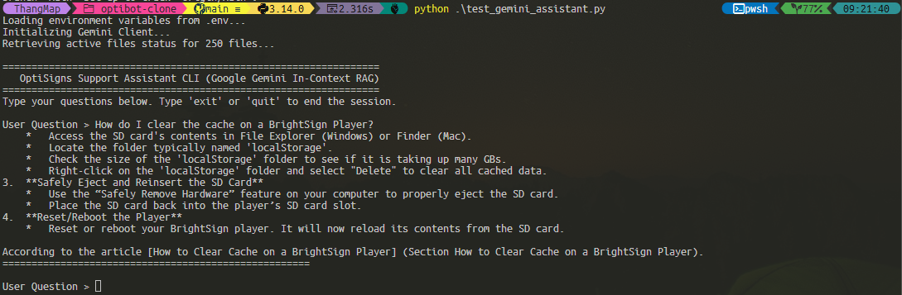

# OptiSigns Support Assistant & Daily Sync (Gemini RAG)

A containerized pipeline to sync Zendesk support articles to Google Gemini File Storage, serving a RAG-based query CLI chatbot (Clonebot) with cited source URLs.

For a detailed breakdown of the codebase architecture, helper modules, chunking strategies, and Mermaid diagrams, see [details.md](details.md).

---

## 1. Setup

### Pre-requisites
Ensure Python 3.10+ is installed:
```bash
python -m pip install google-genai beautifulsoup4
```

### Environment Config
Create a `.env` file in the root directory:
```env
GEMINI_API_KEY=your-actual-api-key-here
```

---

## 2. How to Run Locally

### A. Run Daily Sync Job (Scrapes, Delta checks, and Uploads)
```bash
python main.py
```
*Creates/updates state and writes the [sync_run_report.json](sync_run_report.json) artifact.*

### B. Run the RAG CLI Chatbot (Clonebot)
* **Interactive Mode:** `python test_gemini_assistant.py`
* **Single Query Mode:** `python test_gemini_assistant.py "How do I add a YouTube video?"`

---

## 3. Daily Job Logs & Artifacts
* **Last Sync Run Report (Staged Stably):** [sync_run_report.json](sync_run_report.json) (Contains added, updated, and skipped counts).
* **Active Files Config:** [gemini_config.json](gemini_config.json)
* **Production Logs:** Access the dashboard log streams on your cloud provider:
  * **DigitalOcean:** App details -> *Job Logs* tab
  * **Render:** Cron Service -> *Logs* tab
  * **Railway:** Service settings -> *Deployments/Logs* tab

---

## 4. Assistant QA Citation Screenshot

Below is a demonstration of the Gemini Support Assistant answering the sample question with precise document-level citations:


