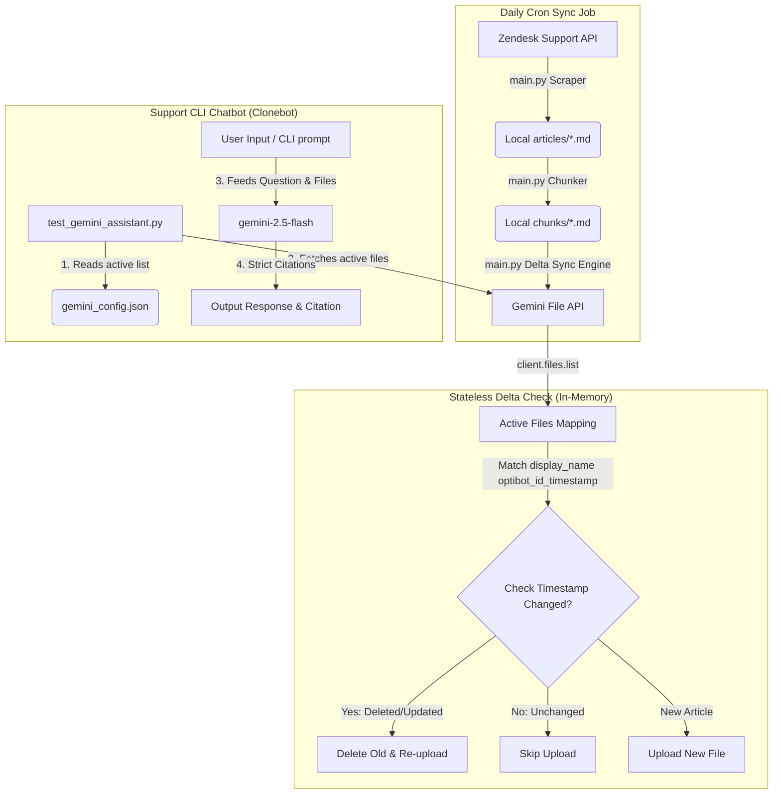

# OptiSigns Support Ingestion, Stateless Delta Sync & Google Gemini CLI RAG

This project implements a production-ready, containerized pipeline to scrape Zendesk Help Center articles for **OptiSigns digital signage**, perform stateless delta-synchronization to Google Gemini AI Studio's File Storage, and serve a RAG-based (Retrieval-Augmented Generation) query CLI assistant that outputs precise answers with heading-level citations.

---

## 1. Project Architecture & Workflows



---

## 2. File-by-File Breakdown & Inner Workings

### A. Ingestion Helper: `ingest_articles.py`
* **Purpose:** Provides the core HTML-to-Markdown normalization logic. 
* **Key Components:**
  * **HTMLToMarkdownConverter:** Walks the HTML DOM tree using `BeautifulSoup` to map raw tags to clean Markdown syntax:
    * Headings (`h1`-`h6`) -> `#` to `######` Markdown headers.
    * Lists (`ul`/`ol`/`li`) -> Nested markdown dash or numeric bullet points.
    * Tables (`table`/`tr`/`td`/`th`) -> Standard markdown formatting with pipes and alignment dashes.
    * Exclusions: Automatically filters out non-content tags such as `<nav>`, `<header>`, `<footer>`, `<aside>`, and elements containing ids/classes matching keywords like `sidebar`, `promo-banner`, `advertisement`, or `social-share`.
  * **get_slug:** Slugifies article titles to create consistent local filenames.

### B. Daily Sync Orchestrator: `main.py` (Default Docker Entrypoint)
* **Purpose:** Scrapes, chunks, performs stateless delta-syncing, and uploads content to the Gemini API.
* **Execution Steps:**
  1. **Scrape with Pagination:** Queries Zendesk Help Center API page-by-page fetching **up to 250 articles** to ensure full coverage of late-published articles (such as YouTube app integrations).
  2. **Retrieve Gemini File State:** Lists all currently active files on the Gemini API using `client.files.list()`. It extracts metadata from their `display_name` (structured as `optibot_<article_id>_<zendesk_updated_at>`).
  3. **Delta Sync Operations:**
     * **NEW:** If a Zendesk article ID is not present in the Gemini files metadata list, it normalizes it to markdown, splits it into semantic chunks (using our chunking strategy below), bundles them into a temporary file, and uploads it.
     * **UPDATED:** If the article exists on Gemini but the Zendesk `updated_at` timestamp doesn't match the metadata, the old file is deleted from Gemini storage via `client.files.delete(name=file_name)` and the updated file is re-uploaded.
     * **UNCHANGED:** If the timestamp matches, it is skipped.
     * **DELETED:** If an article exists on Gemini with prefix `optibot_` but was removed from Zendesk, it is deleted from Gemini storage.
  4. **Config Output:** Saves the list of all currently active Gemini file identifiers into [gemini_config.json](file:///c:/Users/ThangMap/Desktop/Repositories/optibot-clone/gemini_config.json).

### C. QA CLI Tool (Clonebot): `test_gemini_assistant.py`
* **Purpose:** Interactive terminal interface that feeds active knowledge files to Gemini to perform RAG.
* **Execution Steps:**
  1. Reads the active file identifiers list from `gemini_config.json`.
  2. Resolves them against the Gemini API using `client.files.get()`.
  3. Starts either **Single Query Mode** or **Interactive Loop Mode** depending on how it was run (see CLI usage).
  4. Calls `gemini-2.5-flash` passing the files list and the query, constrained by strict rules to output formatting (concise answers, lists, and heading-level citations).

---

## 3. Markdown-Aware Section-Based Chunking Strategy

To make support articles searchable and preserve the contextual accuracy of our RAG pipeline, we implement **Markdown-Aware Section-Based Chunking**:
1. **Header-Based Splitting:** Splits each Markdown document on Heading boundaries (`#`, `##`, `###`).
2. **Metadata Injection:** For each section chunk, it prepends the parent article title and heading context to keep semantic context intact for vector calculations:
   ```markdown
   Document: <Article Title>
   Section: <Heading Name>
   ---
   [Section Text Content]
   ```
3. **Size limit control:** Chunks are capped at **1,500 characters**. If a section exceeds this limit, it is recursively split on paragraph boundaries (`\n\n`) using a **200-character overlap** between sub-chunks, maintaining the prepended context header and part index (e.g. `[Part 2/3]`).

---

## 4. Setup & Installation

### Step 1: Environment Variables
Create a `.env` file in the root workspace directory:
```env
GEMINI_API_KEY=your-actual-api-key-here
```

### Step 2: Install Dependencies
Ensure you have Python 3.10+ installed, then run:
```bash
python -m pip install google-genai beautifulsoup4
```

---

## 5. Script & CLI Execution Guide

### Running the Daily Sync Pipeline
You can trigger the scraper, delta check, and upload sync by running:
```bash
python main.py
```
*On successive runs, you will see it skipping all unchanged files (delta sync is active).*

---

### Using the Clonebot (CLI Support Chatbot)
You can run the RAG chatbot client in two ways:

#### A. Interactive Loop Mode (Continuous Chat)
To chat with the chatbot and query anything about OptiSigns interactively, simply run the script with **no arguments**:
```bash
python test_gemini_assistant.py
```
**Example Session:**
```text
=================================================================
   OptiSigns Support Assistant CLI (Google Gemini In-Context RAG)
=================================================================
Type your questions below. Type 'exit' or 'quit' to end the session.

User Question > How do I add a YouTube video?
Assistant: [Thinking...]

================== Gemini Response ==================
To add a YouTube video to OptiSigns, follow these steps:
1. Log in to your OptiSigns portal.
2. Navigate to Files/Assets, then select App.
3. Choose the YouTube Playlist app.
...
According to the article [How to use YouTube Playlist with OptiSigns] (Section: How to use YouTube Playlist with OptiSigns).
=====================================================

User Question > How do I access troubleshooting?
Assistant: [Thinking...]
...
```

#### B. Single Query Mode (Command Line Argument)
To run a quick search query directly from your shell and output the answer, pass your question as command line arguments:
```bash
python test_gemini_assistant.py "How do I access the troubleshooting page?"
```

---

## 6. Docker Containerization & Scheduling

### Build the Image
To build the lightweight container image locally:
```bash
docker build -t optibot-sync .
```

### Run the Daily Sync Job in Docker
To run the delta-scraper sync job inside the container (mounting the workspace directory to persist `gemini_config.json` locally):
```bash
docker run --env-file .env -v "${PWD}:/app" optibot-sync
```

### Run the Interactive CLI inside Docker
To start the interactive Clonebot inside the Docker container:
```bash
docker run -it --env-file .env -v "${PWD}:/app" optibot-sync python test_gemini_assistant.py
```

### Scheduling the Sync Job on Cloud Hosting (Daily 1x)
To schedule `main.py` as a daily scheduled job in production:

#### Render
1. Create a **Cron Job** service.
2. Link this repository.
3. Set the schedule cron expression to: `0 0 * * *` (runs once per day at midnight).
4. Set the command to: `python main.py`.
5. Add `GEMINI_API_KEY` to the environment variables list.

#### Railway
1. Create a new service from this repository.
2. Change the **Service Type** to **Cron** under service settings.
3. Configure the schedule to `0 0 * * *`.
4. Inject `GEMINI_API_KEY` under the variables tab.
